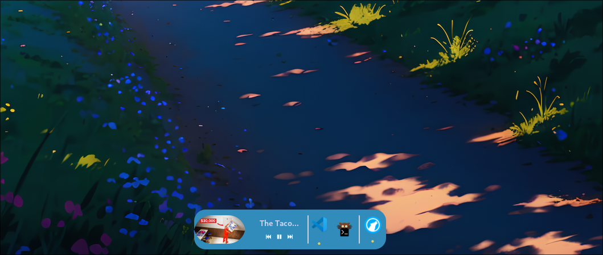

⚓DockWaver
=========

DockWaver is a stylish and customizable dock for Hyprland. It shows your pinned `.desktop` applications, running apps, and includes media controls with video thumbnails — all while allowing full customization via config files.

Features
--------

- ⚓ Application Dock  
  Pin and displays all applications with `.desktop` files for quick launching.

- 🎵 Media Controls  
  Built-in media controls: Play/Pause, Forward, Backward, with:
  - Current media title displayed
  - Thumbnail of the video or album art (when available)

- 🪟 Running Applications View  
  Shows currently opened apps running on your system.

- 🎨 Customizable Design  
  Modify the look and feel of the dock using:
  - config/config.ini – For behavior and layout settings
  - config/style.css – For visual styling

Folder Structure
----------------

DockWaver/
├── config/
│   ├── config.ini     # Configuration for dock settings
│   └── style.css      # CSS styling for the dock
├── dock.py            # Entry point of DockWaver
├── README.md
└── ...

---

## 🛠️ Built With

- **Python 3**
- **GTK 3.0** – For GUI components
- **D-Bus** – For system/media control

---


## 📸 Screenshots

>    

---

## 📦 Installation

make sure these packages are installed on your system
`sudo pacman -S python-gobject gtk3 playerctl gtk-layer-shell`
and
`pip install pyGObject pycairo configparser dbus-python`

1. **Clone the repo**
   ```bash
   git clone https://github.com/NaturalCapsule/DockWaver
   ```

2. **Goto directory**
   ```bash
   cd dock
   ```

3. **Launch**
   Warning!: When you run dock.py the `config` folder should be moved to `.config/` if not, move it manually
   ```bash
   GDK_BACKEND=wayland python dock.py
